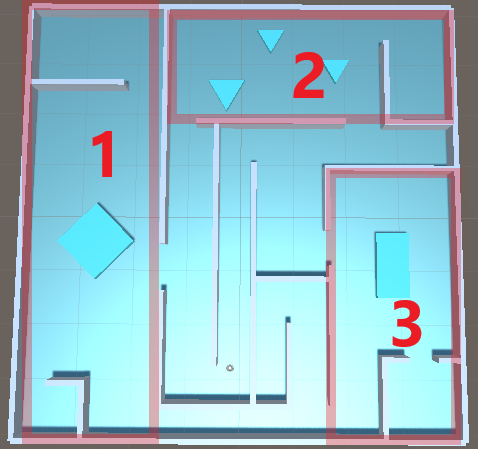
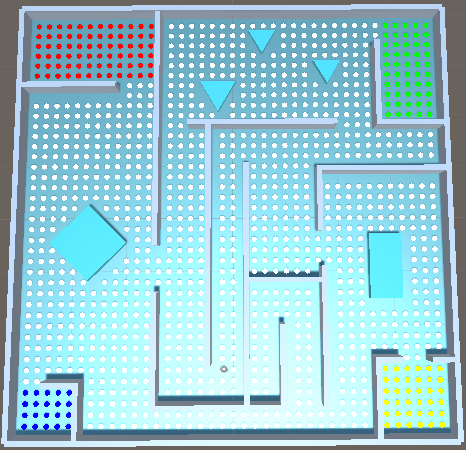
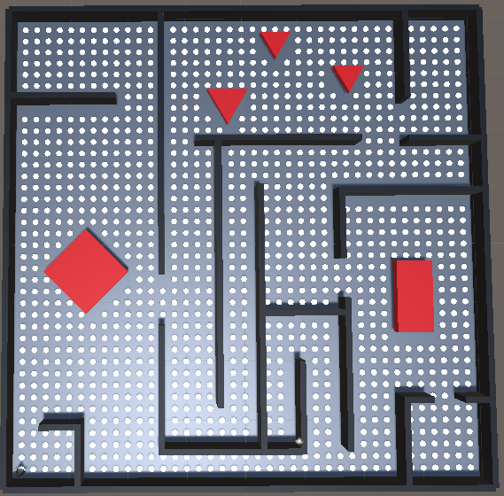
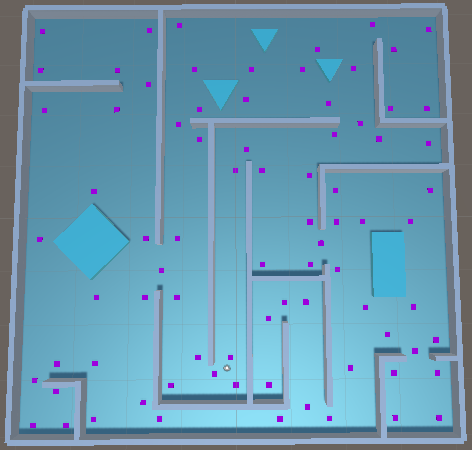
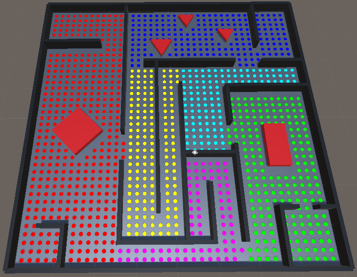
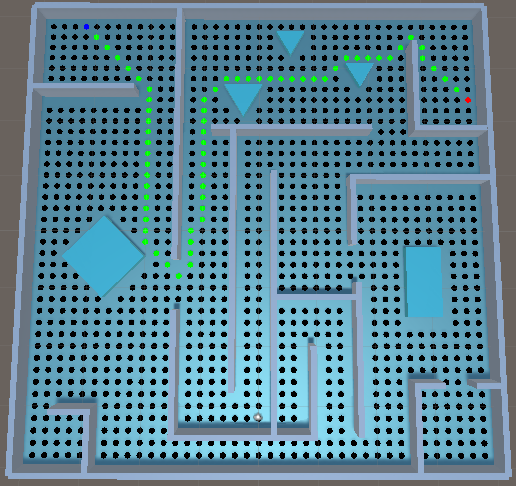
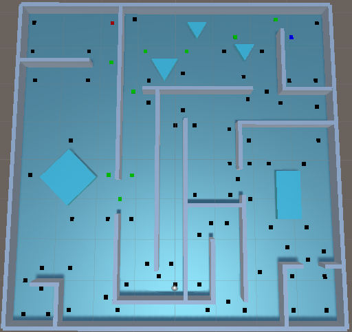
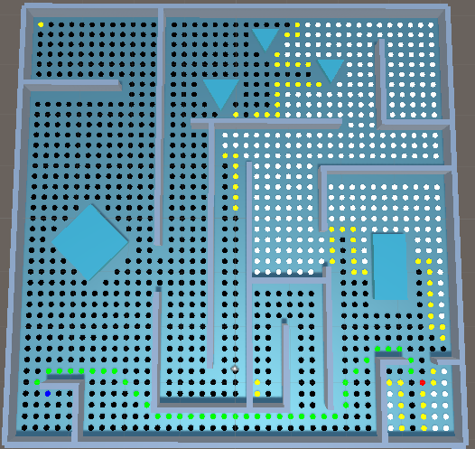
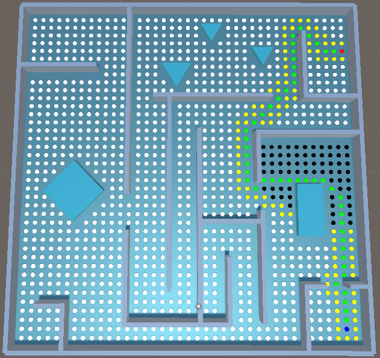
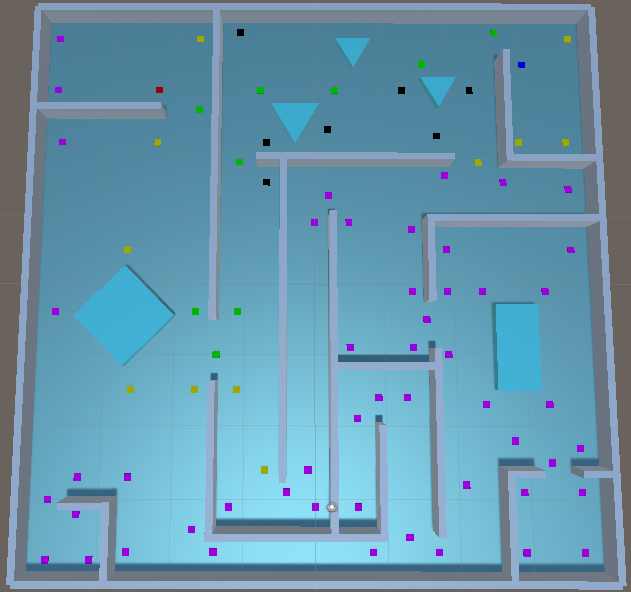

# comp476-assignment2    
## Personal information    
COMP476 Assignment #1: Advanced Game Development, Concordia University    
Presented by: Thomas Backs    
ID: 27554524    
***
## Introduction    
 In our games, there is 1200 regular grid tile graph nodes (*click [here](#regular-grid-tile-graph-map) to see the map*), and 80 point of visibility graph nodes (*click [here](#point-of-visibility-graph-map) to see the map*). In our code we will use the abbreviation for each in order to clearly identify which graph that variable belong to and to facilitate identification as well. for our regular grid tile graph, we use **rgtg** and for our point of visibility graph node we use **povg**.    
 
## Control and UI
The UI is pretty straightforward, on bottom right corner there is a camera attached to the penguin GameObject to be able to clearly follow the pathing and direction of it. On top right, there is some useful information about the current run such as the current pathfinding graph, between RGTG (*Regular Grid Tile Graph*) and POVG (*Point of Visibility Graph*) which are stored as `rgtg_mode` boolean value in our game. Under it there is the A* Algorithm mode choosen, there is three (3) possible algorithm to choo between `DIJSKTRA, EUCLIDEAN, CLUSTER` which are stored as enumerator in our game. To swap between these mode simply use ***1***, ***2***, or ***3***, `1 = DIJKSTRA, 2 = EUCLIDEAN, 3 = CLUSTER`.  The last one in blue, is the cost to reach the target node. Also, you can press ***V*** to enable/disable the node visibility.    

## R1) Level and Pathfinding Graphs
Click [here](#map-layout) to see the map layout with red outline to assign the room. In the screenshot you can clearly see that each room is assigned with a number. The room has been made using **BorderAnWalls** game object in Unity, and the floor is stored in **Floor** game object. The obstacles has a darker shade of blue the hexadimal code is #40F5F3, it represent ice walls to block our penguin path to its goal node. In room 1, there is 1 closet at bottom left of the map, and another one at top. All other rooms only has 1 closet or small room. Each room has two open exit to allow the penguin to walk across the room to reach its goal. The corridor form a "maze" in the middle of our map, with two that lead to dead-end. One is a short and another is deep.    

There is two different pathfinding graphs in our map, one is regular grid tile graph (*click [here](#regular-grid-tile-graph-map) to see the screenshot*) and the other use point of visibility graph(*click [here](#point-of-visibility-graph-map) to see the screenshot*). There is 1200 nodes for our regular grid tile graph, and 80 for our point of visibility one.    

We have a script file called `Node.cs` that is used for both rgtg and pov nodes. The rgtg way contains an array list called `rgtg_neighbours` of size eight (8). While our povg use a list of type **Node** called `povg_neighbours` to store its neighbours. The script also contains various float to store important information about our node such as `cost_so_far, heuristic_value` and `total_estimated_value`. These are of type float. We also store a public boolean variable called `rgtg`. There is also a public Node type called `previous` to store previous node that will be used to make connection for our pathfinding algorithm. On `Awake` we disable the visibility of node to later on activate the one that we currently use. There is also a public function called `ResetValue()` which will reset our current variable that we have saved for our nodes to zero for next iteration. For the neighbours, for our regular grid tile graph method, we have a function in `Pathfinding.cs` file called `CreatedNeighbours(Node node)`. This function is called by the function `BuildGrap()` that will build our graph for our game. In this function, it will take the node and check all position around itself (*up, up-right, right, bottom-right, bottom, bottom-left, left, and up-left*) by finding if a node "n" correspond to our condition which roughly translate to this: take the position of node "n" and substract it to the position of node "node" and check if the difference is equivalent to the one that we are looking for. If so, then add in our array, otherwise leave it as null. This is dynamic and created at runtime. For the point of visibility one, we manually store each neightbours in the list as you can see on Scene through all our game object under **PoVGraph** named **PovNode XX** where XX represents a number. Now for visual purpose and clarity, the regular grid tile graph nodes are represented as white circle on the map, while the point of visibility graph node are showned as magenta square on our map. This color also mean that these nodes are currently in our node list which are named `rgtg_node_list` and `povg_node_list` respectively. Again you can see it in our screenshots. There is also few Getter and Setter for our float value which are protected and not public. These will be called and used often in our `Pathfinding.cs` script    

To build our graph, there is a function called `BuildGraph()` that is stored in `Pathfinding.cs` script file. it will store both regular grid tile graph and point of visibility graph in an array of Game Object called `rgtg_node_graph` and `povg_node_graph` respectively. Which will then be stored in a List of Node name `rgtg_node_list` and `povg_node_List` respectively. It will also create few closet list of type Node based on the node position and will be stored in `rgtg_closet[#]_nodes` and `povg_closet[#]_nodes` respectively where # correspond of a number between 1 and 4.    

## R2) A* Algorithm
There is three (3) different algorithm called Dijkstra, Eulidean and Cluster. All of the are used with either regular grid tile graph or point of visibility. The default one when you start the Game as it, is regular grid tile graph using Dijkstra algorithm. The color code for the nodes are the following: ***white*** means unvisited node in regular grid tile graph, ***magenta*** is the same for point of visibility graph, ***black*** means the node is closed, ***yellow*** means the node is currently open, ***green*** means this node is used for our penguin path. And finally ***blue*** and ***red*** are used to determine the start and target node respectively. For any way we pick, these colors code remain the same. And once the penguin has reached his target, it will swich mode to either rgtg or povg depending of what his previous graph mode has been used.    

### Dijkstra Algorithm
This is called in these two function: `CalculateDijkstraRgtg()` and `CalculateDijkstraPovg()`. These functions will start by taking the starting node and add it to the `[rgtg/povg]_open_list` and then it will enter inside a while loop which will calculate its total estimated value of the current and neightbour nodes. Also it will check if the neighbour node of the current selected node is either in open or closed list. if it is in closed list and the new cost so far is better than the currently one in the neighbour, it will update the cost so far, calculate the new estimated value, set the current node as previous, remove it from closed it and add it in the open list back again. If the neighbour is already in the open list and the new cost so far is better than the current one, it will update the cost so far, calculate new estimate value, and set the previous to the current node. if it isn't in either list then we set the new cost so far, calculate the new estimate value, and add it to the open list. After than, we add the target node to our path list. and we create the path by calling the `Pathing[Rgtg/Povg]` function which will store the path in a list. once the list has been created, we reverse it in order to have to have proper order from start to target. Click [here](#dijkstra-pathing) for Dijkstra example in screenshot.   

### Euclidean Algorithm   
This is called in these two function: `CalculateEuclideanRgtg()` and `CalculateEuclideanPovg()`. These functions will start by taking the starting node and add it to the `[rgtg/povg]_open_list`, then it will calculate the heuristic and the estimate cost for the starting node that is added to the open list. It will enter in a while loop, first it will find the node with the lowest total estimate value as current node. if the current node is the target we break the loop, otherwis, we remove the current node from the open list and add it in the closed list. then we loop through the current node neighbour, for each neightbour we check if it is either in closed or open list. We calculate the neighbour new cost so far and its new heuristic value as well. To calculate the heuristic we take the cost of current node and its neighbour and we multiply it by our `HEURISTIC_MULTIPLIER` variable which is 9 (*various value has been used for testing and we chose 9 as it felt more right and save more time*). If it is in closed list and the new cost so far is better than the currently one in the neighbour, it will update the cost so far, calculate the new estimated value, set the current node as previous, remove it from closed it and add it in the open list. If the neighbour is already in the open list and the new cost so far is better than the current one, it will update the cost so far, calculate new estimate value, and set the previous to the current node. If it isn't in either list then we set the new cost so far, calculate the new estimate value, and add it to the open list. After that, we add the target node to our path list. and we create the path by calling the `Pathing[Rgtg/povg]` function which will store the path in a lost. once the list has been created, we reverse it in order to have the proper order from start to target. Click [here](#euclidean-pathing) for Euclidean example in screenshot.    

### Cluster Algorithm    
The Cluster method is a bit particular, in order to regroup the cluster group, we use the layer option in Unity3d and we named these as following: `cluster0, cluster1, cluster2, cluster3, cluster4, cluster5`, and `cluster6`. The cluster grouping is shown [here](#cluster-grouping-b-color-map). The color chart and its mapping is also explained in the screenshot. Before doing some calculation of pathing, it will call these two function in `Start()` which are: `RgtgLookupTable(NUMBER_OF_LAYERS);` and `PovgLookupTable(NUMBER_OF_LAYERS);`. This will build our `[rgtg/povg]_cluster` 2d list, then will determine the start and end cluster group, and we store the Node of each cluster group to our respective start and target node. In order to store our weight, that will be calculate by this function `Calculate[Rgtg/Povg]Weight(List<Node> path, int start, int end)`. This function will determine our start index, and our end index. it will check if they are neighbour or not otherwise, it will calculate the total cost from our start index until the end index and return it as weight in our list at position `i`.

This is called in these two function: `CalculateEuclideanRgtg()` and `CalculateEuclideanPovg()`. These functions will start by taking the starting node and add it to the `[rgtg/povg]_open_list`, then it will calculate the heuristic and the estimate cost for the starting node that is added to the open list. It will enter in a while loop, first it will find the node with the lowest total estimate value as current node. if the current node is the target we break the loop, otherwis, we remove the current node from the open list and add it in the closed list. then we loop through the current node neighbour, for each neightbour we check if it is either in closed or open list. We calculate the neighbour new cost so far, then we calculate its heuristic. To calculate the heuristic value of our nodes is a bit different, first we store the layer both our target and neighbour, then we calculate our new heuristic value by multiplying our `HEURISTIC_MULTIPLIER` with the cost distance between the neighbour and our target and then we add this function `GetRgtgInClusterHeuristic(neighbour_layer_temp, target_layer_temp)`. Inside that function, which return a float value, it will 0.0f if the current layer index is less than the count of our `[rgtg/povg]_cluster` 2-D list or if the target index is higher than the `rgtg/povg_cluster[current_index].Count`. Otherwise it will return the heuristic stored at this position in our table. If it is in closed list and the new cost so far is better than the currently one in the neighbour, it will update the cost so far, calculate the new estimated value, set the current node as previous, remove it from closed it and add it in the open list. If the neighbour is already in the open list and the new cost so far is better than the current one, it will update the cost so far, calculate new estimate value, and set the previous to the current node. If it isn't in either list then we set the new cost so far, calculate the new estimate value, and add it to the open list. After that, we add the target node to our path list. and we create the path by calling the `Pathing[Rgtg/povg]` function which will store the path in a lost. once the list has been created, we reverse it in order to have the proper order from start to target. Click [here](#cluster-pathing) for Cluster example in screenshot.    

### Penguin.cs    
This scripts will handle our Penguin AI movement behaviour by using the Steering Arrive with Align. It has these float variables named `max_velocity, max_rotation_velocity, max_acceleration, max_rotation_acceleration, time_to_target, current_rotation_velocity, current_velocity, distance_from_target, current_acceleration`. These are variables needed for our functions mentionned below. There is alos two Vector3 variables which are `direction_vector` and `player_distance`. These functions below are called inside the `Update()` functions of [Pathfinding.cs](#pathfindingcs).    
* public void Move(Vector3 target_position, bool target_node)    
    * This function will calculate the arrive movement toward the toward using the Steering approach mentioned in our slides. The parameters required for this are the `Vector3 target_position` and the `bool target_node`. If it is set to true, it will slow down toward the goal target, otherwise it will apply the normal velocity movement.  
* public bool Stop()
    * This function will force the penguin to stop its action. and reset the `current_velocity` to 0.0f if true. otherwise it will keep moving toward the target. It is called if the angle between its target and the penguin is over the threshold. This will also allow a "smoother" movement and look, less laggy.
* public bool AlignTowardTarget()
    * This function will be called to align the penguin toward its target node to ensure it is moving in the right direction, it will correct its trajectory if the angle between the target and the penguin is over the threshold, if so, it will correct it's alignment and rotates the penguin toward the target, this is execute after the `Stop()` function.    

## Screenshots    

### Map Layout
    

### Closet Map
    

Each color correspond a different closet, `rgtg_closet1_nodes` is blue, `rgtg_closet2_nodes` is red, `rgtg_closet3_nodes` is green, and `rgtg_closet4_nodes` is yellow.    

### Regular Grid Tile Graph Map
    

### Point of Visibility Graph Map
    

### Cluster grouping by color Map    
    
`cluster0` is red, `cluster1` is blue, `cluster2` is green, `cluster3` is magenta, `cluster4` is yellow, and `cluster5` is cyan.    

### Dijkstra Pathing
     

### Euclidean Pathing
     
 
### Cluster Pathing    
     

## Sources 
The course slides are also my reference as well as this website: https://www.redblobgames.com/pathfinding/   
The source for 3d penguin: https://free3d.com/3d-model/emperor-penguin-601811.html
The explanation for grid and graph: https://www.redblobgames.com/pathfinding/grids/graphs.html    
The explanation for A*: https://www.redblobgames.com/pathfinding/a-star/introduction.html    
