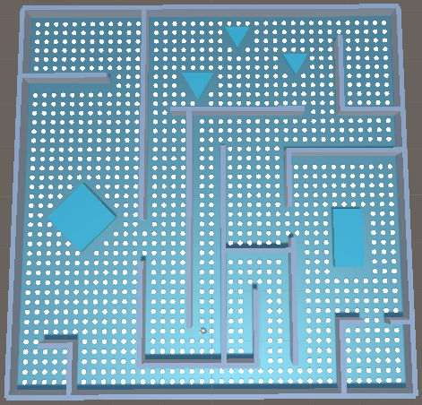

# comp476-assignment2    
## Personal information    
COMP476 Assignment #1: Advanced Game Development, Concordia University    
Presented by: Thomas Backs    
ID: 27554524    
***
## Introduction    
 In our games, there is 1200 regular grid tile graph nodes (*click [here](#regular-grid-tile-graph-map) to see the map*), and 80 point of visibility graph nodes (*click [here](#point-of-visibility-graph-map) to see the map*). In our code we will use the abbreviation for each in order to clearly identify which graph that variable belong to and to facilitate identification as well. for our regular grid tile graph, we use **rgtg** and for our point of visibility graph node we use **povg**.    
 
## Control and UI
The UI is pretty straightforward, on bottom right corner there is a camera attached to the penguin GameObject to be able to clearly follow the pathing and direction of it. On top right, there is some useful information about the current run such as the current pathfinding graph, between RGTG (*Regular Grid Tile Graph*) and POVG (*Point of Visibility Graph*) which are stored as `rgtg_mode` boolean value in our game. Under it there is the A* Algorithm mode choosen, there is three (3) possible algorithm to choo between `DIJSKTRA, EUCLIDEAN, CLUSTER` which are stored as enumerator in our game. To swap between these mode simply use 1, 2, or 3, `1 = DIJKSTRA, 2 = EUCLIDEAN, 3 = CLUSTER`. The last one in blue, is the cost to reach the target node.    

## R1) Level and Pathfinding Graphs
Click [here](#map-layout) to see the map layout with red outline to assign the room. In the screenshot you can clearly see that each room is assigned with a number. The room has been made using **BorderAnWalls** game object in Unity, and the floor is stored in **Floor** game object. The obstacles has a darker shade of blue the hexadimal code is #40F5F3, it represent ice walls to block our penguin path to its goal node. In room 1, there is 1 closet at bottom left of the map, and another one at top. All other rooms only has 1 closet or small room. Each room has two open exit to allow the penguin to walk across the room to reach its goal. The corridor form a "maze" in the middle of our map, with two that lead to dead-end. One is a short and another is deep.    

There is two different pathfinding graphs in our map, one is regular grid tile graph (*click [here](#regular-grid-tile-graph-map) to see the screenshot*) and the other use point of visibility graph(*click [here](#point-of-visibility-graph-map) to see the screenshot*). There is 1200 nodes for our regular grid tile graph, and 80 for our point of visibility one.    

We have a script file called `Node.cs` that is used for both rgtg and pov nodes. The rgtg way contains an array list called `rgtg_neighbours` of size eight (8). While our povg use a list of type **Node** called `povg_neighbours` to store its neighbours. The script also contains various float to store important information about our node such as `cost_so_far, heuristic_value` and `total_estimated_value`. These are of type float. We also store a public boolean variable called `rgtg`. There is also a public Node type called `previous` to store previous node that will be used to make connection for our pathfinding algorithm. On `Awake` we disable the visibility of node to later on activate the one that we currently use. There is also a public function called `ResetValue()` which will reset our current variable that we have saved for our nodes to zero for next iteration. For the neighbours, for our regular grid tile graph method, we have a function in `Pathfinding.cs` file called `CreatedNeighbours(Node node)`. This function is called by the function `BuildGrap()` that will build our graph for our game. In this function, it will take the node and check all position around itself (*up, up-right, right, bottom-right, bottom, bottom-left, left, and up-left*) by finding if a node "n" correspond to our condition which roughly translate to this: take the position of node "n" and substract it to the position of node "node" and check if the difference is equivalent to the one that we are looking for. If so, then add in our array, otherwise leave it as null. This is dynamic and created at runtime. For the point of visibility one, we manually store each neightbours in the list as you can see on Scene through all our game object under **PoVGraph** named **PovNode XX** where XX represents a number. Now for visual purpose and clarity, the regular grid tile graph nodes are represented as white circle on the map, while the point of visibility graph node are showned as magenta square on our map. This color also mean that these nodes are currently in our node list which are named `rgtg_node_list` and `povg_node_list` respectively. Again you can see it in our screenshots. There is also few Getter and Setter for our float value which are protected and not public. These will be called and used often in our `Pathfinding.cs` script    

To build our graph, there is a function called `BuildGraph()` that is stored in `Pathfinding.cs` script file. it will store both regular grid tile graph and point of visibility graph in an array of Game Object called `rgtg_node_graph` and `povg_node_graph` respectively. Which will then be stored in a List of Node name `rgtg_node_list` and `povg_node_List` respectively. It will also create few closet list of type Node based on the node position and will be stored in `rgtg_closet[#]_nodes` and `povg_closet[#]_nodes` respectively where # correspond of a number between 1 and 4.    

## R2) A* Algorithm

### Pathfinding.cs
This scripts will handle pathfinding calculation and pathing connection as well for both regular grid tile graph and point of visibility graph. `public AIBehaviour penguin_script` is needed to trace the path for the penguin game object. `Vector3 map_size` to hold the size of our game map, it is set in Start(). It also has `public enum Modes { DIJSKTRA, EUCLIDEAN, CLUSTER }` to determine the current pathfinding mode, the current mode: `public Modes current_mode = Modes.DIJSKTRA`. it also has a boolean `public bool rgtg_mode = true` to determine if we use regular grid tile graph or point of visibility.     
These variables  are used for regular grid tile graph function, notice that they all start with rgtg to facilitate their identification and their reason for existing.    
`Vector3 rgtg_node_size` determine the node size, the value is calculated and set in the Start() function below. `float rgtg_density` is the divisor for our map size to determine the number of tile to have which gives us an evenly divided node size throughout our map.
`public Node [type]_start_node;` determine our starting node, replace type is either rgtg or pov. `public Node [type]_target_node` determine our target node. `public List<Node> [type]_node_list = new List<Node>()` will contains *all* available node belonging to its type. `public List<Node> [type]_path_list = new List<Node>()` will contain all node that AI will *cross* as path. `public List<Node> [type]_open_list = new List<Node>()` will contains all *open* node yet to be visited. `public List<Node> [type]_closed_list = new List<Node>()` will contains all *closed* node that won't be used for our path, `public List<Node> [type]_closet#_nodes = new List<Node>()`, contains all nodes that is in a closet, there is 4 closets in our map click [here](#closet-map) to go to map screenshot with number. `public Node [type]_random_node` to pick a random node inside a closet to be set as our target. We use the Node instead of GameObject for our [Pathfinding.cs](#pathfindingcs) file, because we will need to access to many function and variable inside the [Node.cs](#nodecs) script and creating a holder for both GameObject AND Script for all our needs is useless since we mostly just going to need the script of each node to do our work.

### Penguin.cs    
This scripts will handle our Penguin AI movement behaviour by using the Steering Arrive with Align. It has these float variables named `max_velocity, max_rotation_velocity, max_acceleration, max_rotation_acceleration, time_to_target, current_rotation_velocity, current_velocity, distance_from_target, current_acceleration`. These are variables needed for our functions mentionned below. There is alos two Vector3 variables which are `direction_vector` and `player_distance`. These functions below are called inside the `Update()` functions of [Pathfinding.cs](#pathfindingcs).    
* public void Move(Vector3 target_position, bool target_node)    
    * This function will calculate the arrive movement toward the toward using the Steering approach mentioned in our slides. The parameters required for this are the `Vector3 target_position` and the `bool target_node`. If it is set to true, it will slow down toward the goal target, otherwise it will apply the normal velocity movement.  
* public bool Stop()
    * This function will force the penguin to stop its action. and reset the `current_velocity` to 0.0f if true. otherwise it will keep moving toward the target. It is called if the angle between its target and the penguin is over the threshold. This will also allow a "smoother" movement and look, less laggy.
* public bool AlignTowardTarget()
    * This function will be called to align the penguin toward its target node to ensure it is moving in the right direction, it will correct its trajectory if the angle between the target and the penguin is over the threshold, if so, it will correct it's alignment and rotates the penguin toward the target, this is execute after the `Stop()` function.    

## Screenshots    

### Map Layout

### Closet Map
    

Each color correspond a different closet, `rgtg_closet1_nodes` is blue, `rgtg_closet2_nodes` is red, `rgtg_closet3_nodes` is green, and `rgtg_closet4_nodes` is yellow.    

### Regular Grid Tile Graph Map
    

### Point of Visibility Graph Map
    

### Cluster grouping by color Map    
    

## Sources 
The source for 3d penguin: https://free3d.com/3d-model/emperor-penguin-601811.html
